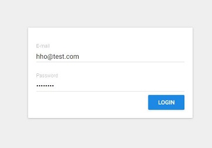
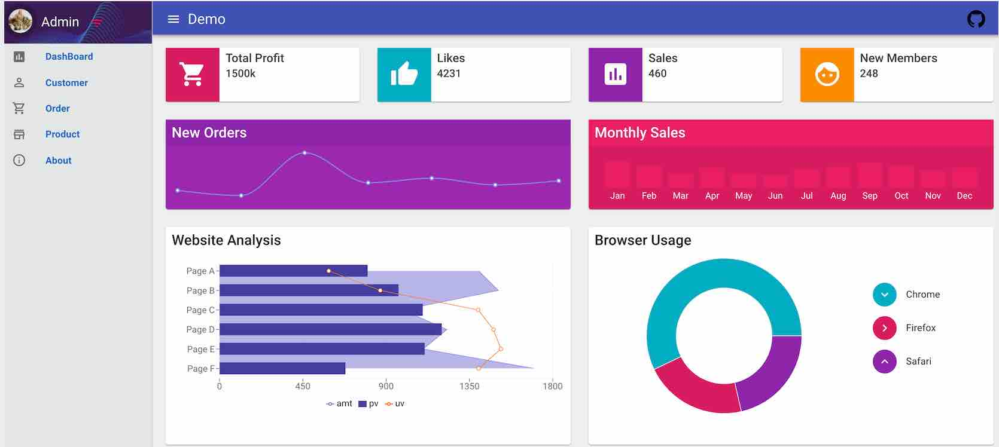
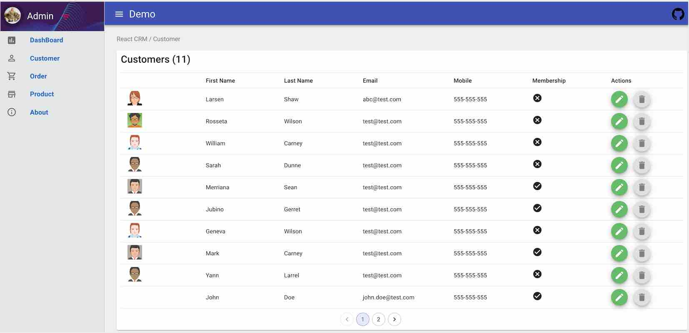
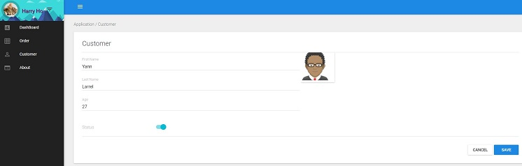
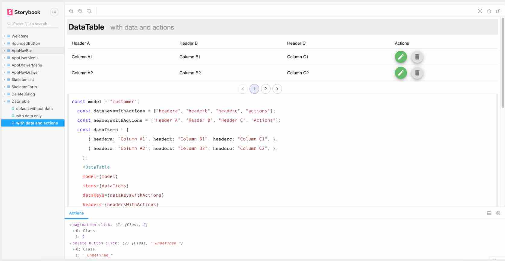

# React Redux CRM

> A reusable CRM project for real-world business based on React 16, React-Redux & Material-UI 4

This is the very first version, feel free to use for any app. Contributions are always welcome!

The goal of this starter project is to create reusable project for real-world business. To achieve this target, we need a solution which should include simple authentication process, restful API with token support and simple but elegant UI design.

### Features

- This project is built on the top of React/Redux.
- The UI component are mainly built on Material-UI.
- This project uses Redux-Thunk to support back-end API.
- The backend API is just readonly dump service.
- Use Formik to manage the form submission
- Integrate with storybook for react.
- The project is built on TypeScript 3.x
- ~~Use Formsy to manage form submission~~
- ~~To simulate real-world business, this starter project chooses Json-Server as fake Restful API. (You can simple replace it with your own API)~~

### Live Demo

[Demo](https://react-app-demo.harryho.org) The demo is just a proof of concept. It doesn't have back-end API and all features of master branch.

### Screenshots







<!--  -->

----

Storybook
  



## Build Setup

```bash
# Clone project
git clone https://github.com/harryho/react-crm.git


# install the packages with npm
cd react-crm
npm install

# start the server with hot reload at localhost:4000
npm start
# or yarn
yarn start

# Storybook
## Start storybook
npm run storybook
## Build storybook
npm run build-storybook

## build for production
npm run build

```


## Docker 

```bash
## Run / Test release without building new image
npm run build

# Launch nginx image to test latest release
docker pull nginx:alpine
docker run -p 8080:80 -v \
    <your_aboslute_path>/dist:/usr/share/nginx/html nginx:alpine


# Build release image
docker build . -t  rc-prd:2.0

# Launch the development image in the backgroud
docker run -d --publish 8080:80  --name rc2 rc-prd:2.0

# Check the log
docker logs rc2  -f
```

## Welcome to fork or clone

For detailed explanation on how things work, checkout following links please.

- [React](https://facebook.github.io/react/)
- [Redux](http://redux.js.org/)
- [Material-UI](http://www.material-ui.com/)

### Alternatives

There are another two similar projects respectively built on the Vue.js and Angular. If you have interests in those technical stacks. You can find and clone those repositories below.

- [Ng-MD-App](https://github.com/harryho/ng-md-app.git).
- [Ng4Crm](https://github.com/harryho/ng4crm.git). (It is no longer maintained with latest Angular)
- [Vue-Crm](https://github.com/harryho/vue-crm.git).

### Change log

- May 2020 -  Merge the branch rctsx to master

  After the merge, the whole project moved to new techncial stack - TypeScript 3. Also, the Material-UI is upgraded to 4.x version.


- Dec 2018 - Rebase demo branch to master

  New master doesn't rely on Json-Server as fake API. It will only have Readonly fake API. It means any new or updated data will be stored to any physical file. All test data will be rolled back after system restart.

- May 2018 -  Create an archived branch json-server

  This branch was the master which used Json-Server as fake API. Considering the hiccup of setting Json-Server up and maintenance, it will be replaced by fake service ( Readonly fake API). You still can find clone this branch by branch name **json-server**, but it will be no longer updated. It is an archived branch.
