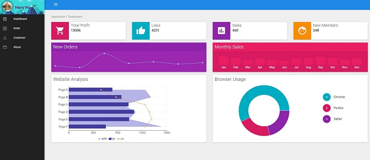
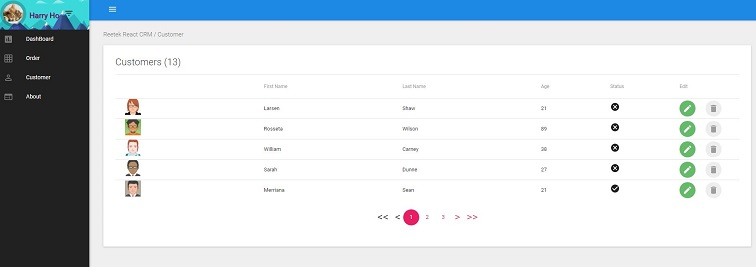

# React Redux CRM


> A reusable CRM project for real-world business based on React 15.4, React-Redux & Material-UI

This is the very first version, feel free to use for any app. Contributions are always welcome!

The goal of this starter project is to create reusable project for real-world business. To achieve this target, we need a solution which should include simple authentication process, restful API with token support and simple but elegant UI design. 


#### Features

* This project is built on the top of React/Redux. 
* The UI part of this project uses Material-UI. 
* This project uses Redux-Thunk to support back-end API.
* To simulate real-world business, this starter project chooses Json-Server as fake Restful API. (You can simple replace it with your own API)
* CRUD functions for Customer, Order, Product


#### Screenshots







## Build Setup

``` bash

# Clone project
git clone https://github.com/harryho/react-crm.git


# install the packages with npm
cd react-crm
npm install

# start the server with hot reload at localhost:4000
npm run start

## You will see the following output. You can test API with the URLs via browser.
##
##  \{^_^}/ hi!
##
##  Loading db/db.json
##  Done
##
##  Resources
##  http://localhost:5354/token
##  http://localhost:5354/customers
##  http://localhost:5354/orders
##  http://localhost:5354/products
##  http://localhost:5354/categories
##
##  Home
##  http://localhost:5354
##
##  Type s + enter at any time to create a snapshot of the database
##
##....................
##....................
##
##[BS] Access URLs:
## ------------------------------------
##       Local: http://localhost:4000
##    External: http://192.168.1.5:4000
## ------------------------------------
##          UI: http://localhost:4001
## UI External: http://192.168.1.5:4001
## ------------------------------------
##[BS] Serving files from: src
##[BS] Watching files...
##webpack: wait until bundle finished: /index.html


# Visit the app at [http://localhost:4000](http://localhost:4000)

```


# Welcome to fork or clone!

For detailed explanation on how things work, checkout following links please.

* [React](https://facebook.github.io/react/)
* [Redux](http://redux.js.org/)
* [Material-UI](http://www.material-ui.com/)


#### Alternatives

There are another two similar projects respectively built on the Vue.js and Angular. If you have interests in those technical stacks. You can find and clone those repositories below.

* [Ng-MD-App](https://github.com/harryho/ng-md-app.git).
* [Ng4Crm](https://github.com/harryho/ng4crm.git). (It is no longer maintained with latest Angular)
* [Vue2Crm](https://github.com/harryho/vue2crm.git).