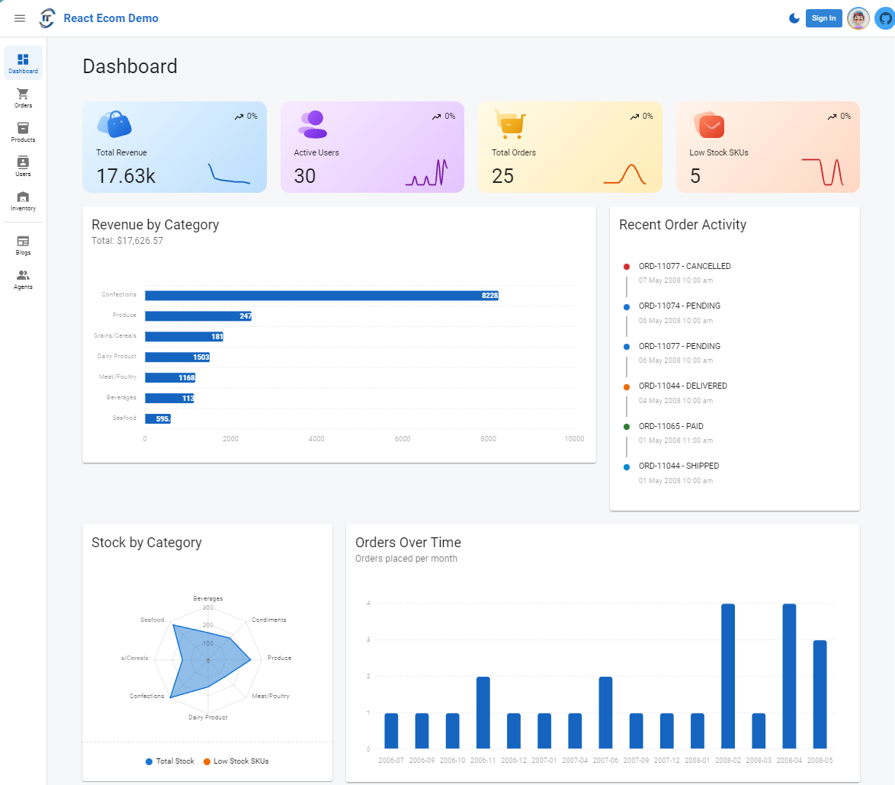
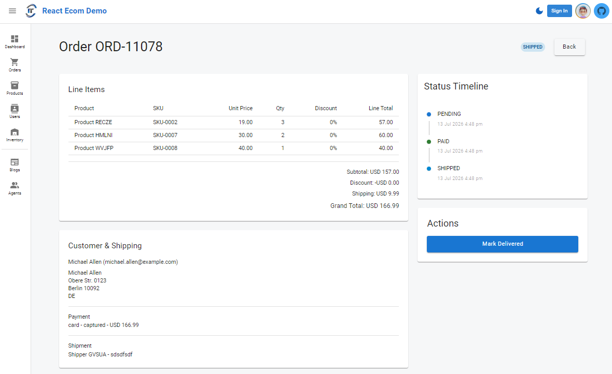
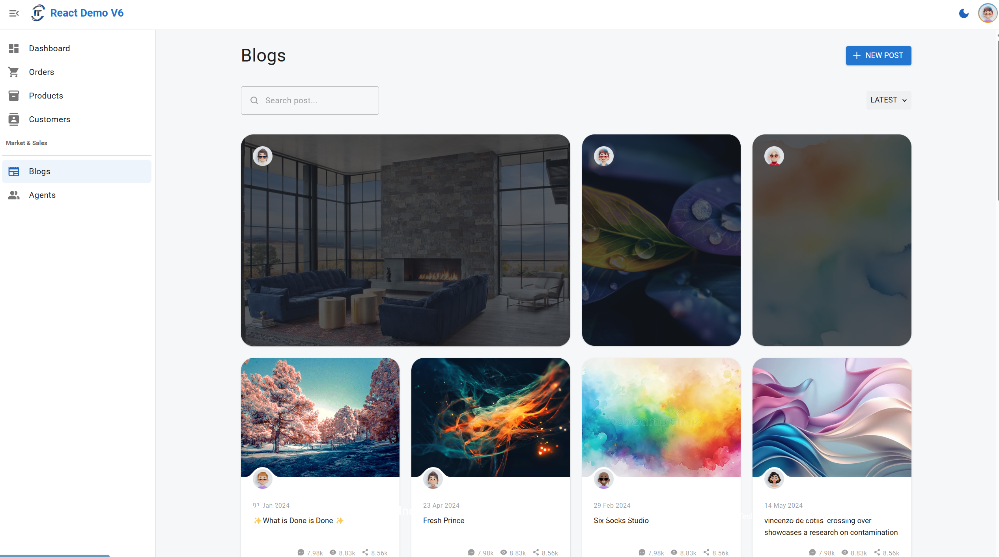
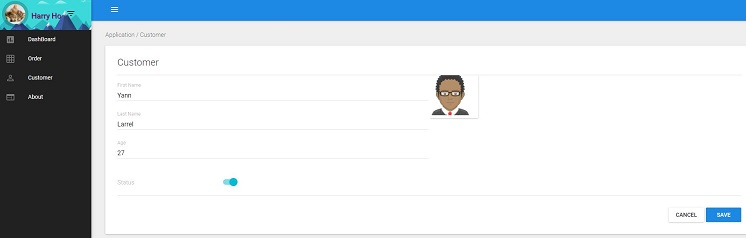
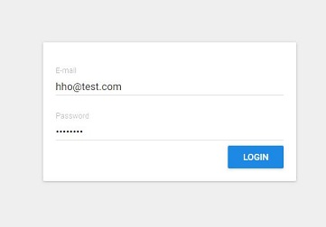
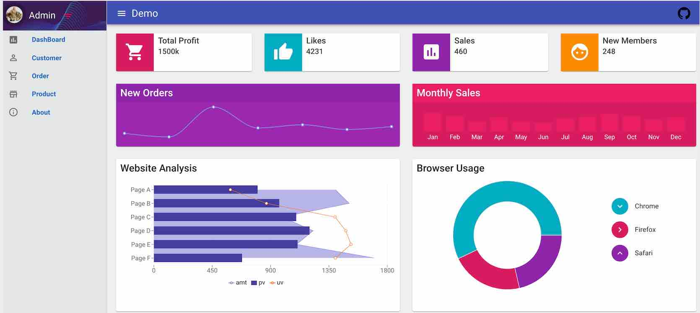
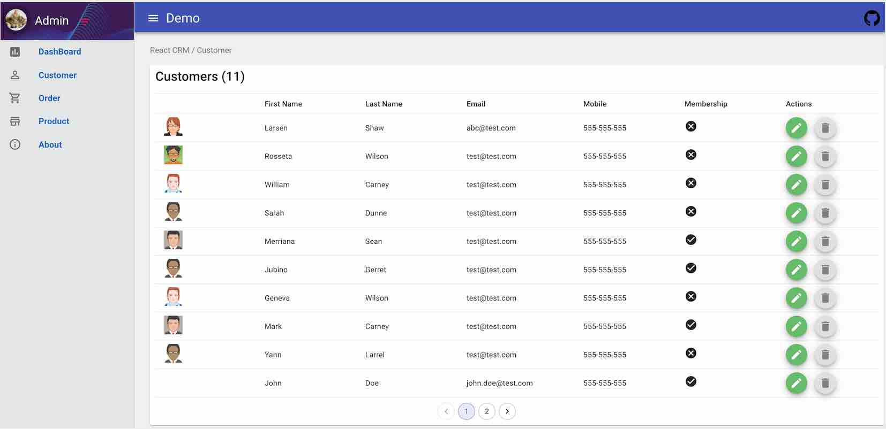
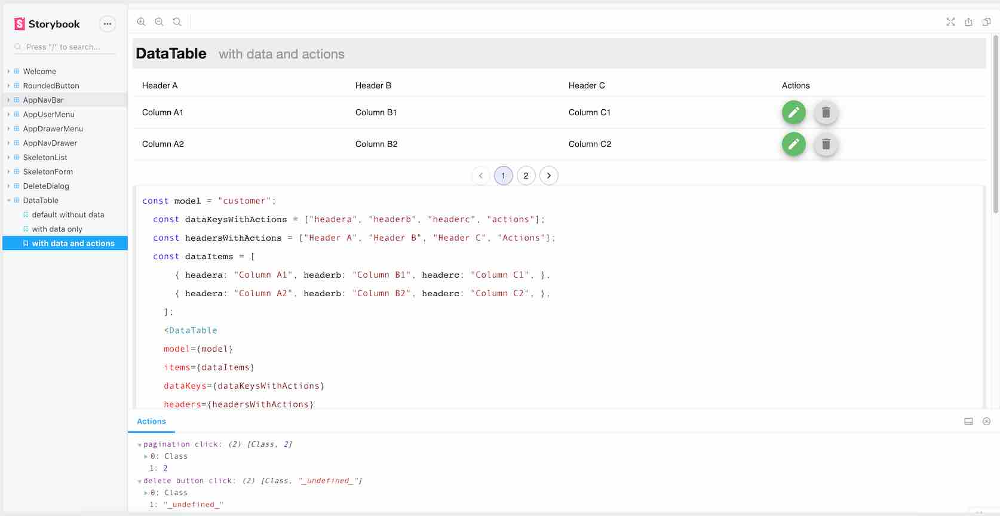

<h1 align="center">
  React Ecom Demo
</h1>

This react ecom demo is built on the top of my customized React boilerplate with Storybook. 

The boilerplate repo is available [here](https://github.com/harryho/storybook-react-vite-ts-template). 

If you want to build something simpler from scratch, you can follow the README to build your own app step by step.


### Live Demo

[Demo](https://react-demo-v6.harryho.org/) The demo is just a proof of concept. It doesn't have back-end API and all features of master branch.

### Screenshots








<!--  -->

----

## Prerequisites

- **Node.js >= 22** (required by Vite 8; enforced via `engines`)
- **Yarn 1.22+** — the repo ships a `yarn.lock`; do not mix with npm or pnpm
- **TypeScript >= 5.9**, **React 19.2**, **MUI 7.3**, **react-router 7.18**, **Vite 8.1**, **Storybook 10.5**, **MSW 2.3**, **Vitest 3.2**

Quick check: `node -v` should report v22.x or newer.

----

## Getting Started

```bash
git clone https://github.com/harryho/react-crm.git
cd react-crm
yarn install

yarn dev             # Vite + MSW mock API on http://localhost:5173
yarn storybook       # Storybook on http://localhost:6006
yarn test            # Vitest unit tests
yarn build           # tsc + Vite production build
```

----


### Previous demo

[Previous Demo](https://react-demo-v4.harryho.org/) The demo is built on React 16 and Mui 4. Source code is available [here](https://github.com/harryho/react-crm/tree/r16m4)

#### Screenshots

<!--  -->



<!--  -->

#### Storybook
   



### Change log

- Jul 2026 — Added full CRUD for Users / Products / Orders / Cart, a checkout → payment → shipment pipeline, dashboard analytics from live data, route-level code-splitting, production MSW, real Storybook stories, and a Vitest + Testing Library test setup.

- Jun 2026 — Platform uplift and domain rework. Bumped to React 19.2, MUI 7.3, react-router 7.18, Vite 8.1, Storybook 10.5, TypeScript 5.9. Replaced json-server with **MSW 2** service-worker mocks and a typed fetch client. See [Prerequisites](#prerequisites) for the new toolchain floor.

- Apr 2025 - Merge latest demo to master branch.

- Dec 2024 - React 18 and Mui 6 live demo is released.

- Jun 2024 - Uplifting to React 18 and Mui 6 is in progress.

- May 2020 -  Merge the branch rctsx to master

  After the merge, the whole project moved to new technical stack - TypeScript 3. Also, the Material-UI is upgraded to 4.x version. Nodejs 12.x is recommended.

- Dec 2018 - Rebase demo branch to master

  New master doesn't rely on Json-Server as fake API. It will only have Readonly fake API. It means any new or updated data will be stored to any physical file. All test data will be rolled back after system restart.

- May 2018 -  Create an archived branch json-server

  This branch was the master which used Json-Server as fake API. Considering the hiccup of setting Json-Server up and maintenance, it will be replaced by fake service ( Readonly fake API). You still can find clone this branch by branch name **json-server**, but it will be no longer updated. It is an archived branch.